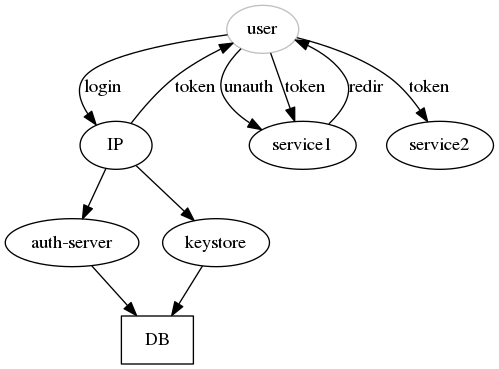
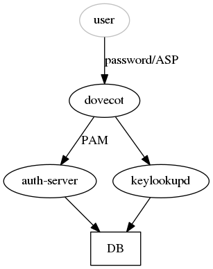
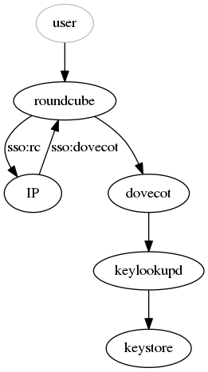
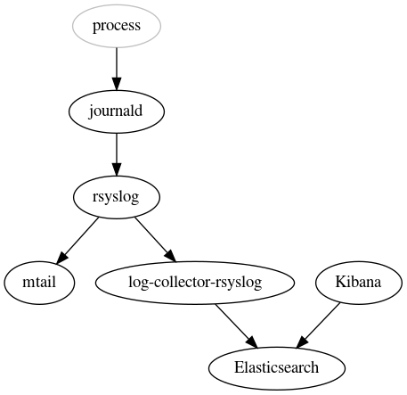

*float* Reference
===

### Table of contents

[[_TOC_]]


# Services

The fundamental concept in *float* is the **service**, a loose
articulation of compute elements (containers, system-level daemons)
and data, with standardized metadata properties that float uses to
integrate it with its infrastructure.

A description of the service (its *specification*) is provided to
float as part of its configuration. Float can manage an arbitrary
number of services on a single infrastructure. The mapping between a
"float service" and a "high-level, user-visible service" is quite
often not one-to-one: float services are meant to describe the
high-level service's *internal* architecture, which can be made up of
multiple components.

In float, a service is also a *schedulable unit*: the service
specification is in fact a template for specific service instances, of
which there can be again more than one; consider for example the case
of service replication for reliability / high-availability purposes.
Float will never schedule more than one instance of a service on each
host.

The decision to assign an instance of a service to a specific host is
called *scheduling*, and it is completely controlled by float based on
parameters of the service specification: it is possible to control the
desired number of instances, and to restrict the choice of possible
hosts by using host groups (leveraging the Ansible host group
concept). The operator has no control on the specific assignments
beyond that, and they may change at any time.

Float's scheduler is not particularly smart. It does not perform any
kind of bin-packing (it only looks at instance counts), and, most
importantly, it is *offline*-only: scheduling is only performed when
Ansible runs, there is no online component to rebalance instances when
they fail or to react to changes in load etc.

The float scheduler produces *stable* and *reproducible* results,
which is very important given how it is meant to be used. The
randomness used by the scheduling algorithm is seeded on the
configuration itself, so two people running float on the same
configuration on two different machines will obtain identical
assignments.

## Compute units

Compute units in float are long-running processes controlled via
systemd. Float creates a systemd unit for every service instance on
the hosts where it is supposed to run.

It is possible to specify more than one compute unit for the same
service: in this case, they will all be scheduled together as part of
the same service instance, and they will be reachable under the same
service name (supposedly they will be using different network ports
for communication).

### Structuring services in terms of compute units

To show one possible approach to the subdivision of a service into
fundamental compute units, we're going to show an example scenario and
demonstrate the reasoning behind some possible choices, and how they
relate to concepts in *float*.

Let's consider as an example a fairly typical two-layer service that
uses Apache + PHP to serve a website, ignoring an eventual MySQL for
now. This is a request-based service so some of the considerations
that we're going to make will be specific to this perspective.

There are two major possibilities for representing such a service
within float:

1. a float service "apache" and another float service "php", which may
   potentially be scheduled on different hosts, and that talk to each
   other over the service boundary: apache finds php endpoints using
   float's service discovery mechanism (i.e. DNS);
2. a single float service "web", with apache and php bundled together
   as a single unit of deployment, where apache talks to php inside
   the service boundary (i.e. it connects to localhost). This scenario
   can be further split into two:
   1. the float service "web" consists of an apache container and a
      separate php container, each runs independently of the other,
      they talk to each other either over the network (on localhost),
      or via an explicitly shared mechanism on the host (for instance
      a shared /run/web/sockets directory);
   2. the float service "web" consists of a single container that
      bundles together apache and php, maybe here they talk to each
      other via a /run/web/sockets directory that is completely 
      internal to the container itself.

Obviously the first problem to solve is that abstractions must make
sense to you and to the specific problem you're solving. Here the
"apache" and "php" components were pretty obvious choices for the
two-layer service we were considering.

The second thing to consider in terms of *float* architecture is what
we want the *request flow* to be: how, specifically, each component in
our service stack is supposed to talk to the following one as the
request flows downstream through the layers. Including float's reverse
proxy layer in the picture, the conceptual flow is quite simple:

```
reverse proxy
    |
    V 
  apache
    |
    V
   php
```

These components may be scheduled on different hosts (or not), so one
thing to consider is what the latency at each step will be. Generally,
as you move downwards the service stack, there is also a fan-out
factor to consider: consider a PHP script making multiple MySQL
requests, for instance.

The choice of representation depends on a number of different criteria
and decisions, of which we'll name a few:

* A good question to consider is "what kind of actions do you want to
  take in order to scale your service"? Maybe you run a datacenter,
  servers are just bare compute capacity for you, and can just add new
  ones when apache or php look busy, independently, in which case
  you'd go towards scenario #1. Or perhaps your service is
  data-partitioned, and to add a new server means moving some of your
  data to it, in which case it would makes sense to co-locate apache
  and php with the data, which makes scenario #2 look more suitable.
* If your service is distributed among hosts in different locations,
  you might like scenario #2 more as it contains the latency to the
  reverse proxy -> apache hop.
* For scenario #2, to decide amongst its two variants, another good
  question is "how do you like to build your containers"? This is a
  release engineering topic that depends on your CI, on what your
  upstreams look like, etc.

In terms of container bundling (#2.1 vs #2.2 above), we like our
containers do to "one thing", for whatever definition of "thing" you
find useful (provide a service, for example), so we run an init daemon
inside our containers to differentiate between important processes,
that control the lifecycle of the container itself, and non-important
ones that can simply be restarted whenever they fail.

For instance, let's consider a hypothetical mailing list service: this
has at least two major inbound APIs, a SMTP entry point for message
submission, and an HTTP API for mailing list management. These are
implemented by separate processes. We also want to run, say, a
Prometheus exporter, yet another separate process: but we don't
particularly care about its fate as long as it is running, and anyway
monitoring will tell us if it's not running, so this process is "less
important" than the first two.  We would have these three processes in
a single container, with the first two marked as "important" (i.e. the
container will terminate when they exit, signaling a failure to float
through systemd and monitoring), while the exporter would be marked as
not-important and simply silently restarted whenever it fails.

### Containers

The primary form of compute unit in float is a container. Float will
automatically download the images and run the containers specified in
the service description.

Though it is possible to run all kinds of container images, float is
explicitly tuned towards a very particular kind of it:

* logs to standard output/error
* can run as an arbitrary (not known in advance) user ID, does not
  require to be run as internal uid 0
* can run from a read-only root filesystem image (except for the usual
  /tmp /run etc)
* can be configured via environment variables

Such containers will result in the least amount of additional
configuration in the service description.

Float can use either docker or Podman for running containers, though
on modern systems (Debian buster and up) it will choose Podman.

### System-level daemons

Since float controls services by representing them as systemd units,
it is also possible to create services that are made of system-level
processes, i.e. "normal" systemd units.

This is convenient, for instance, when you are migrating an existing
infrastructure to float, and you want to control the pace of
containerization of your services: if you can describe your service in
terms float understands, you can continue to configure it at the
system level using Ansible and at the same time take advantage of
float's infrastructural services.

### Networking

Compute units in float share the host network namespace, network
daemons are normally expected to bind to 0.0.0.0, while float manages
the firewall to prevent unauthorized access.

Since the service mechanism discovery provides no way to do port
resolution, all instances of a service are expected to use the same
ports.

Float supports automatic provisioning of the firewall for TCP ports,
in the following way:

* ports specified in a container description can be reached by other
  containers running on the same host, specifically other containers
  parts of the same service, as *localhost*;
* ports specified in the service description can be reached by other
  hosts (over the float infrastructure internal network overlay);
* ports that are part of the service's *public endpoints* can be
  reached by the float frontend reverse gateway hosts, over the
  internal network overlay;
* ports that are part of the service's *monitoring endpoints* can be
  reached by the hosts where the monitoring scrapers are running, over
  the internal network overlay.

In no case float will allow public access to a service. If this is
desired, or if a service requires unsupported networking configuration
(UDP, other protocols, etc.), it has to be achieved by adding the
relevant firewall configuration snippet manually via the service's
Ansible role.

### Users and permissions

For isolation purposes, float will create a dedicated UNIX user and
group for every service on the hosts where its instances run. For
historical reasons, this user will be called `docker-`*servicename*.
The containers will be run as this user, unless explicitly configured
otherwise.

If you need to share data with the container, for instance by mounting
data volumes, use this user (or group) for filesystem permissions.

If the service has any *service_credentials*, a dedicated UNIX group
will be created for those named *credentials-name*`-credentials`, and
the service user will be a member of it.

## Data

Datasets allow you to describe data that is attached to a service:
this information will be used to automatically configure the backup
system. A dataset is either a local filesystem path, or something that
can be dumped/loaded via a pipe. It is associated with every instance
of the service, so it usually identifies local data. This assumes a
partitioned service by default. But master-elected services can use
the *on_master_only* option to make backups of global, replicated
datasets only once (on the service master host).

### Backups

If provided with credentials for an external data repository, float
will automatically make backups of your configured datasets. Float
runs its own backup management system
([tabacco](https://git.autistici.org/ai3/tools/tabacco)) on top of
Restic, which adds additional metadata to Restic snapshots to map
float datasets.

When a service is scheduled on a new host, for instance as a result of
a re-scheduling, float will attempt to restore the associated datasets
from their backups. While this is not a practical failover solution
for complex services, we've found it works pretty well for a category
of services with "important, but small - can afford to lose one day of
changes" datasets that is quite common and useful in itself. For these
services, running with num_instances=1 and counting on the
backup/restore data move mechanism might provide sufficient
availability and reliability.

Restores can of course also be triggered manually whenever necessary.

### Volumes

Volumes represent LVs that are associated with a service. They are
managed by float, which makes sure that they are present on the
hosts. Volumes aren't currently being ever removed, because we're
scared of deleting data.

## SSL Credentials

In the spirit of separation between internal and user-facing concerns,
float offers both an internal X509 PKI for mutual service
authentication, and an integration with ACME services such as
Letsencrypt for user-facing SSL certificates.

### Internal mTLS PKI

Service communication should be encrypted, and communicating services
should authenticate each other. One of the ways to do this is with TLS
as the transport layer. Float provides its own *service PKI* to
automatically generate X509 credentials for all services.

The X509 certificates are deployed on the host filesystem, and access
to them is controlled via UNIX permissions (using a dedicated group,
which the service user is a member of). This provides an attestation
of UNIX identity across the whole infrastructure.

Each service, in *services.yml*, can define multiple credentials, each
with its own name and attributes: this can be useful for complex
services with multiple processes, but in most cases there will be just
a single credential, with the same name as the service. When multiple
credentials are used, all server certificates will have the same DNS
names (those associated with the service), so it's unusual to have
multiple server credentials in a service specification.

Credentials are saved below `/etc/credentials/x509/<name>`, with
the following structure:

```
    /etc/credentials/x509/<name>/
      +-- ca.pem                   CA certificate for the service PKI
      +-- client/
      |   +-- cert.pem             Client certificate
      |   \-- private_key.pem      Client private key
      \-- server/
          +-- cert.pem             Server certificate
          \-- private_key.pem      Server private key
```

Private keys are stored unencrypted, and are only readable by the
`<name>-credentials` group. The user that the service runs as must be
a member of this group.

Server certificates will include all the names and IP addresses that
service backends are reachable as. This includes:

* *service_name.domain*
* *service_name*
* *hostname.service_name.domain*
* *hostname.service_name*
* *shard.service_name.domain* (if present)
* *fqdn*
* localhost
* all public IP addresses of the host
* all IP addresses of the host on its network overlays

The purpose is to pass server name validation on the largest number of
clients possible, without forcing a specific implementation.

Client certificates have the following names, note that it is using
the credentials name, not the service name:

* *name.domain*
* *name*

Using multiple client credentials for a single service might allow ACL
separation in complex services.

Most legacy services should be able to implement CA-based client
certificate validation, which at least protects the transport from
unprivileged observers. But some clients can validate the client
certificate CN, which implements a form of distributed UNIX permission
check (the client had access to a specific certificate), and is
therefore preferable.

### Public credentials

Float runs an ACME client to generate valid SSL certificates for
public-facing HTTPS domains associated with a service.

Since these SSL certificates are relatively short-lived, the ACME
mechanics run online on the target infrastructure: certificates are
continuously renewed, not only when you run Ansible.

SSL certificates are normally only consumed by the *frontend* float
service, where incoming traffic is SSL-terminated by the traffic
routers; internal services run with certificates from the internal PKI
for mutual authentication with the traffic routers. However this is
only the case for HTTP-based services: float does not currently offer
SSL termination for other protocols, in which case the SSL connections
will be forwarded directly to the backend service, which then needs
access to the public SSL certificates. A dedicated mechanism is
provided so that a service can "request" a local copy of the
certificates, and be reloaded when it is updated.


## Configuration

Most services won't be configurable just with environment variables,
and are going to require some sort of configuration file. Float has no
facilities for specifying configuration file contents in the service
description metadata itself: this responsibility is delegated to
Ansible. An Ansible role, associated with the service, should be used
to create the necessary configuration files and other required
system-level setup for the service.

*services.yml*

```yaml
myservice:
  containers:
    - name: http
      image: myservice:stable
      volumes:
        - /etc/myservice.conf: /etc/myservice.conf
```

*roles/myservice/tasks/main.yml*

```yaml
- template:
    src: myservice.conf.j2
    dest: /etc/myservice.conf
    group: docker-myservice
    mode: 0640
```

*roles/myservice/templates/myservice.conf.j2*

```yaml
# Just an example of an Ansible template, with no particular meaning.
domain={{ domain }}
```

The Ansible role then needs to be explicitly associated to the hosts
running the service instances via the Ansible playbook (unfortunately
float can't automatically generate this association itself):

```yaml
- hosts: myservice
  roles:
    - myservice
```

This takes advantage of the fact that float defines an Ansible group
for each service (with the same name as the service itself), which
includes the hosts that the service instances have been scheduled
on. **Note** that since Ansible 2.9, the group names will be
"normalized" according to the rules for Python identifiers,
i.e. dashes will be turned into underscores.

### On the Ansible requirement

Does the above mean you have to learn Ansible in order to use float?
Should you be concerned about investing effort into writing a
configuration for my service in yet another configuration management
system's language? The answer is *yes*, but to a very limited extent:

* You do need knowledge of how to set up an Ansible environment: the
  role of `ansible.cfg`, how to structure `group_vars` etc.  Writing a
  dedicated configuration push system for float was surely an option,
  but we preferred relying on a popular existing ecosystem for this,
  both for convenience of implementation and also to allow a migration
  path of co-existence for legacy systems. To counter-balance, float
  tries to keep its usage of Ansible as limited as possible, to allow
  eventual replacement.

* Most services will only need an extremely simple Ansible role to
  generate the service configuration, normally a mix of *template* and
  *copy* tasks, which are possibly the most basic functionality of any
  configuration management system. This should guarantee a certain
  *ease of portability* to other mechanisms, should one decide to
  migrate away from float. Besides, it is a good sanity check: if your
  service requires complicated setup steps, perhaps it might be
  possible to move some of that complexity *inside* the service
  containers.

To emphasize portability, it might be wise to adhere to the following
rules when writing Ansible roles:

* Try to use only *copy*, *file* and *template* tasks, rather than
  complex Ansible modules;
* avoid using complex conditional logic or loops in your Ansible tasks
* keep the configuration "local" to the service: do not reference
  other services except using the proper service discovery APIs (DNS),
  do not try to look up configuration attributes for other services
  (instead make those into global configuration variables);
* do not use facts from other hosts that need to be discovered (these
  break if you are not using a fact cache when doing partial runs):
  instead, define whatever host attributes you need, explicitly, in
  the inventory;

More generally, the integration with Ansible as the underlying
configuration management engine is the "escape hatch" that allows the
implemention of setups that are not explicitly modeled by float
itself.


# Infrastructure Part 1: Base Layer

We can subdivide what is done by float in two separate sections:
operations and services affecting every host, the so-called "base"
layer of infrastructure, and then the fundamental services that are
part of the "cluster-level" infrastructure (logging, monitoring,
authentication, etc): the latter are part of float but run on the base
layer itself as proper services, with their own descriptions and
Ansible roles to configure them.

Note that, in its default setup, float will naturally assume a
two-tier service topology, with "frontend" hosts handling traffic
routing in a stateless fashion, and "backend" hosts running the actual
services. The default *services.yml.default* service description file
literally expects the *frontend* and *backend* Ansible groups to be
defined in your inventory. However, these are just roles, and there is
nothing inherent in float that limits you to this kind of topology.

## Service Discovery

"How do services find and talk to each other" is a fundamental aspect
of any infrastructural platform. Float offers the following features:

* The ability to set up *overlay* networks to isolate
  service-to-service traffic from the public Internet.
* Services find each other with DNS A / AAAA lookups, so the client
  must know the target port. As a consequence, each service must use a
  globally unique port. This also implies that it's impossible to
  schedule more than one instance of a service on each host.
* DNS views are used to provide topology-aware service resolution, so
  that hosts sharing a network overlay will route service requests
  over that network.
* Connections between services are direct, not mediated by proxies, so
  there is no global load balancing and clients are expected to keep
  track of the state of backends and implement retry policies.
* Services can securely authenticate each other by using credentials
  automatically provided by the service mesh.

Float's implementation of this mechanism is extremely trivial and it
is based on writing static entries to /etc/hosts. It is fundamentally
limited in the number of services and hosts it can support.

### Naming

Services are identified by their *name*, an alphanumeric string (it
can also include dash '-' characters).

All DNS entries are served under an internal domain *domain*.

Every host has its own view of the DNS map. The specific IP addresses
associated with a target service instance will depend on whether the
source and target host share any network overlays, which will be used
in preference to the public IP address of the backend host.

### Locating service backends

The access patterns to backends of a distributed service vary
depending on the service itself: for instance, with services that are
replicated for high-availability, the client usually does not care
which backend it talks to. In other cases, such as with *partitioned*
services, clients need to identify individual backends.

We provide three ways of discovering the IP address of service
backends. The port must be known and fixed at the application level.

Note that in all cases, the DNS map returns the *configured* state of
the services, regardless of their health. It is up to the client to
keep track of the availability status of the individual backends.

#### All backends

The DNS name for *service.domain* results in a response containing the
IP addresses of all configured backends for *service*.

```
$ getent hosts myservice.mydomain
1.2.3.4
2.3.4.5
3.4.5.6
```

Note that due to limitations of the DNS protocol, not all backends may
be discovered this way. It is however expected that a sufficient
number of them will be returned in the DNS response to make high
availability applications possible. If you need the full list of
instances, it is best to obtain it at configuration time via Ansible.

#### Individual backends

Each service instance has a name that identifies it specifically,
obtained by prepending the (short) host name to the service name:

```
$ getent hosts host1.myservice.mydomain
1.2.3.4
```

This is the hostname that the instance should use to advertise itself
to its peers, if the service requires it.

#### Shards

Backends can also have permanent *shard* identifiers, that identify a
specific backend host, and that do not change on reschedules. These
are useful when a service is partitioned across multiple backends and
the hosts have state or data associated with it. A shard identifier is
an alphanumeric literal, specific to the host.

```
$ getent hosts shard1.myservice.mydomain
1.2.3.4
```

#### Master-elected services

When a service uses *master election*, an instance is automatically
picked at configuration time to be the *master* of the service. This
instance will be discoverable along with the other instances when
resolving the service name. In addition, the special DNS name
*service-master.domain* will point at it:

```
$ getent hosts myservice-master.mydomain
2.3.4.5
```


## Network Overlay

It is possible to define internal networks that span multiple hosts,
called *overlays*, which can then be used for service-to-service
traffic, ignoring the details of the actual underlying public network
topology.

For now, only a single IPv4 address can be assigned to a host on each
private network. In the future, it should be possible to assign an
entire subnet, so that individual IPs will be available to services.

The list of network overlays is part of the global float
configuration, and to make a host participate in a network one should
simply define a `ip_<network-name>` attribute for that host in the
Ansible inventory, whose value should be the desired IP address.

The current implementation of private networking uses
[tinc](https://www.tinc-vpn.org/) and sets up a fully connected mesh
between participating hosts. The result is robust and has limited
performance overhead.

When the client and server hosts are on the same private network, the
DNS-based service discovery will return the server's address on that
private network, ensuring that service-to-service communication goes
over the VPN.


## Traffic Routing

While it's possible to configure it to do otherwise, *float* assumes
that your services will run on its isolated, internal private
networks, and it provides a mechanism to expose them publicly and
route external traffic to the correct backend processes.

In the expected setup, one or more hosts should be dedicated to
running the built-in *frontend* service (usually by setting up a host
group and setting the service *scheduling_group* accordingly). Such
hosts will have their public IP addresses advertised to the world via
DNS. The *frontend* service runs a set of *request routers*, or
reverse proxies (NGINX and HAproxy), to route requests to the correct
service backends.

### High-level traffic flow

Float uses a basic two-tier model for serving requests, with a reverse
proxy layer between users and the backend applications. Traffic to
the reverse proxies themselves (hosts running the *frontend* service)
is controlled via DNS: float automatically creates low-TTL DNS records
for its public endpoints. This has all the usual caveats of using DNS
for this purpose, and it isn't really meant as a precise
load-balancing layer.

Reliability is then provided by having multiple backends for the
application itself: the reverse proxies will find one that works. It
is important to note that, at the moment, float provides *no* accurate
load-balancing whatsoever, just basic round-robin or random-selection:
in NGINX, proper load balancing mechanisms are a paid feature.

### HTTP

The infrastructure provides a way for HTTP-based services to expose
themselves to the public Internet by defining public endpoints. The
*public HTTP router* (NGINX) will be automatically configured based on
such service metadata.

The clients of this service are users (or generically, external
clients), not other services, which should instead talk directly to
each other.

The public HTTP router will force all incoming requests to HTTPS.

For implementation details, see the
[nginx Ansible role README](../roles/float-infra-nginx/README.md).

### SSL Certificates

Float will automatically generate SSL certificates for the required
public domain names. However, on first install, to ensure that NGINX
can start while the ACME automation acquires the valid certificates,
it will set up self-signed certificates, and switch to the ACME ones
when they are available.

### HTTP Cache

A global HTTP cache is available for services that require it.

NGINX will set the X-Cache-Status header on responses, so you can
check if the response was cached or not.

The cache TTL is low (10 minutes), and there is currently no mechanism
to explicitly purge the cache.

### Controlling incoming HTTP traffic

The public HTTP router offers the possibility to block incoming
requests based on their User-Agent (to ban bots, etc), or based on the
URL they are trying to access. The latter is often required for
regulatory compliance.

There is documentation of this functionality in the README files below
the
[roles/float-infra-nginx/templates/config/block/](../roles/float-infra-nginx/templates/config/block/)
directory.

### Non-HTTP

It is also possible to route arbitrary TCP traffic from the frontend
hosts to the service backends. In this case, the proxy will not
terminate SSL traffic or otherwise manipulate the request. The
original client IP address will be unavailable to the service.

Define *public_tcp_endpoints* for a service to enable this feature.

Note that there is no functionality for reverse proxying UDP services:
in this scenario you are probably better off scheduling your UDP
service directly on the *frontend* group (or use a different group
altogether and take care of DNS manually).

## Public DNS

Float offers authoritative DNS service, it is part of the *frontend*
service so it will run on the same hosts as the HTTP reverse proxies.

DNS entries are automatically generated for all known
public_endpoints, as well as for the "public" domains in
*domain_public*.

The DNS server is currently Bind, and is itself configured via an
intermediate YAML-based language that supports templates and
inheritance called
[zonetool](https://git.autistici.org/ai3/tools/zonetool).

There is the option of configuring DNSSEC (TODO: add docs).

### Customizing DNS

If you want to set up a custom DNS zone, one way to do so is with a
dedicated Ansible role (to be run on hosts in the *frontend* group)
that installs your desired zonetool configuration.

Let's walk through a complete example: suppose we have a service
*myservice* that should serve HTTP requests for the *myservice.org*
domain. This doesn't match the *service_name*.*domain* scheme that is
expected for services described in *services.yml*, so float won't
automatically generate its DNS configuration.

What we need to do is set up the *myservice.org* DNS zone ourselves,
and then tell float to associate that domain to the *myservice*
service.

First, we create a new Ansible role that we are going to call
*myservice-dns*, so in the root of your Ansible config:

```shell
$ mkdir -p roles/myservice-dns/{handlers,tasks,templates}
```

The only task in the role should install a zonetool DNS configuration
file into */etc/dns/manual*, so in
*roles/myservice-dns/tasks/main.yml* we'll have:

```yaml
---

- name: Install myservice DNS configuration
  template:
    src: myservice.yml.j2
    dest: /etc/dns/manual/myservice.yml
  notify: reload DNS
```

The DNS configuration in our case is very simple and just points "www"
and the top-level domain at the frontends. We do so by extending the
*@base* zone template defined by float. The contents of
*roles/myservice-dns/templates/myservice.yml.j2* should be:

```yaml
---

myservice.org:
  EXTENDS: "@base"
  www: CNAME www.{{ domain_public[0] }}.
```

This points the www domain at the frontends via a CNAME (all the
*domain_public* DNS zones are already autogenerated by float). We
could have just as easily used A records but this is simpler and works
with both IPv4 and IPv6.

The *@base* template already adds NS records (pointing at the
*frontend* hosts where the DNS servers are), and A records for the
unqualified zone name

Finally, we need a handler to reload the updated DNS configuration,
which goes in *roles/myservice-dns/handlers/main.yml* and runs a shell
command to update zonetool:

```yaml
---

- listen: reload DNS
  shell: "/usr/sbin/update-dns && rndc reload"
```

With the above we have a complete Ansible role that configures DNS for
the *myservice.org* domain. We need to tell Ansible that this role
needs to run on the hosts in the *frontend* group, so in your playbook
you should have:

```yaml
- hosts: frontend
  roles:
    - myservice-dns
```

And to complete our configuration, the service description for
*myservice* should have a *public_endpoint* directive including the
domain, so that the float HTTP router knows where to send the
requests:

```yaml
myservice:
  ...
  public_endpoints:
    - name: myservice
      domains:
        - www.myservice.org
        - myservice.org
      port: ...
```

While the above is sufficient to have the float DNS servers serve
authoritative records for the zone, you also have to ensure that the
servers are properly plugged in to the global DNS service. How to do
so depends on many details specific of each situation, and is beyond
the scope of *float*, however it generally involves (assuming your
float infrastructure has *example.com* as domain_public, and you want
to serve *myservice.org* as in the examples above):

* Having at least 2 hosts in the *frontend* group. Float will
  automatically create A records for *ns1.example.com*,
  *ns2.example.com*, etc.
* Setting the nameserver records of *myservice.org* with the domain
  registrar to *ns1.example.com* and, say, *ns2.example.com*.
* Eventually adding glue A records, at the domain registrar, with the
  IP addresses for ns1.example.com and ns2.example.com.

## SSL

The [internal ACME service](https://git.autistici.org/ai3/acmeserver)
continuously monitors the configured list of public domains and
attempts to create or renew valid SSL certificates for them using
Letsencrypt. It is integrated with the HTTP reverse proxy, so it will
use the *http-01* ACME validation protocol, meaning that it is only
able to create certificates for domains that have an A record pointing
to float's frontend hosts.

To prevent issues with starting up daemons and missing certificates,
float will at first generate placeholder self-signed certificates, so
that services can use them even before the ACME automation has had a
chance to create valid ones.

The certificates created by the ACME service are then replicated to
all frontend hosts via the
[replds](https://git.autistici.org/ai3/tools/replds) daemon,
eventually ending up in the */etc/credentials/public* directory.

If a service that is *not* running on the frontend hosts needs access
to the certificates, it can do so by depending on the
*float-infra-acme-storage* role, e.g.:

*roles/myservice/meta/main.yml*

```yaml
---
dependencies:
  - {role: float-infra-acme-storage}
```

which will again ensure that the SSL certificates are present on the
local host's /etc/credentials/public directory.

Access to the SSL certificates is controlled by membership in the
*public-credentials* UNIX group.

If a service needs to be reloaded when its certificates change, it
should install a shell script hook in the
*/etc/acme-storage/reload-hooks* directory. This script will be
invoked every time *any* certificate changes, which is why the script
should inspect whether the specific certificate it cares about has
changed or not (possibly using something like the *if-changed* tool),
to avoid excessive reloads:

```
#!/bin/sh
if-changed /etc/credentials/public/my.dom.ain/ \
    && systemctl restart myservice
exit 0
```

### Generating additional SSL certificates

To customize the ACME server configuration, use a dedicated Ansible
role that runs on the same group as the *acme* service, and dump a
configuration file in /etc/acme/certs.d:

*roles/myservice-acme/tasks/main.yml*

```yaml
- name: Configure ACME for my custom domain
  copy:
    dest: /etc/acme/certs.d/mydomain.yml
    content: |
      - names:
        - "my.dom.ain"
```

*playbook.yml*

```yaml
- hosts: acme
  roles:
    - myservice-acme
```

## SSH

Float can take over the SSH configuration of the managed hosts, and
perform the following tasks:

* create a SSH Certification Authority
* sign the SSH host keys of all hosts with that CA
* add all the admin users' *ssh_keys* to the authorized_key list for
  the **root** user on all hosts.

The underlying access model is very simple and expects admins to log
in as root in order to run Ansible, so you'll most likely want to set
*ansible_user=root* and *ansible_become=false* in your config as well.

Keys used for login will be logged in the audit log, so you can still
tell admins apart.

### SSH Client Setup

You will find the public key for this CA in the
*credentials/ssh/key.pub* file, it will be created the first time you
run the init-credentials playbook.

Assuming that all your target hosts share the same domain (so you can
use a wildcard), you should add the following entry to
*~/.ssh/known_hosts*:

```
@cert_authority *.example.com ssh-ed25519 AAAAC3NzaC1lZDI1NTE5AAA....
```

Since all logins happen as root, it may be convenient to also add a
section to your *~/.ssh/config* file like the following:

```
Host *.example.com
    User root
```

## Integrating base services with other automation

Most float services that deal with config-driven autogenerated
configurations support integrating with other, presumably
service-driven, types of automation.

Consider, for example, the case of a platform for user web hosting:
the main HTTP traffic routing infrastructure has to be extended with
the configuration for all the user domains, which presumably comes out
of a database somewhere.

In order to support such integration, services such as the HTTP
router, DNS, ACME, and others, will also read their configurations
from an *auto* directory (such as */etc/nginx/sites-auto* for
example), which is not managed by float at all and that can be
delegated to the external automation.


# Infrastructure Part 2: Cluster Services

## Authentication and Identity

The float infrastructure provides a full AAA solution that is used by
all the built-in services, and that can be easily integrated with your
services (or at least that would be the intention). It aims to
implement modern solutions, and support moderately complex scenarios,
while keeping things as simple as possible -- an area that could still
see some improvement. It offers the following features:

* supports users and groups (mostly *admins* and eventually *users*)
* supports multiple backends (file, LDAP, SQL, ...)
* mechanisms for account recovery (currently poor, via secondary
  password, other mechanisms should be implemented)
* transparent upgrade of password hashing mechanisms (for
  future-proofing) (somewhat TODO)
* *single sign-on* for HTTP services
* TOTP and U2F authentication mechanisms for HTTP services
* supports passwords tied to specific services (wrongly called
  *application-specific*) for non-HTTP services
* manages secrets (encryption keys) encrypted with the user password,
  in a way that works even over single sign-on
* supports partitioned services
* configurable rate limits and blacklists for brute-force protection
* tracks logins and user devices without storing PII
* it is modular, and can be adapted to the desired scale / shape

However it is important to note that it comes with a very long list of
caveats as well:

* the single sign-on system is implemented with bearer tokens (signed
  HTTP cookies), which have numerous weaknesses, even if one ignores
  the possible implementation failures:
  * bearer tokens are vulnerable to exfiltration (in logs, in user
    browser histories, caches, etc.), which can be partially mitigated
    by short token lifetimes
  * logout is a somewhat ill-defined operation (the current
    implementation relies on borderline-*adtech* techniques in order to
    delete cookies on other services' domains)
  * they rely on a complex chain of HTTP redirects and HTTP headers
    being set in the right place

Most of these features do not have immediate use in the basic services
built-in into the infrastructure, but they are meant instead for the
primary use case for *float*: the implementation of a large-ish email
and hosting provider.

It should therefore be clear that the chosen design involves numerous
trade-offs, some of which we have tried to document here, that are
tailored to the above use case, and might very well not be suitable to
your particular scenario.

In float, the primary user authentication database is provided via a
global variable in your Ansible configuration and
controls access to the internal web-based services that are behind
single sign-on.

### Authentication

All credentials-based authentication (passwords, OTP, U2F) goes
through the main authentication daemon
[auth-server](https://git.autistici.org/id/auth). It translates
authentication requests, containing service name, user name, password,
and other authentication parameters, into database requests to
retrieve the authentication primaries and verify them.

An authentication response has one of three possible states: failure,
success, and the request for further authentication with a second
factor (OTP or U2F, in which case the response will also contain U2F
challenge parameters). On a successful response, the auth-server might
return additional data such as an email address. The auth-server
listens on a UNIX socket, so it usually runs on all machines, and
speaks a simple line-based protocol. There is also a [PAM
module](https://git.autistici.org/id/auth-pam) available to help
integrate your services.

Database lookup queries can be configured separately for each
supported service, along with a number of other parameters.

The default setup in *float* uses a file-based backend for
administrator accounts (in the *admin* group), and eventually a LDAP
database for user accounts (LDAP was a requirement of the main float
use case, SQL support should be added instead).

The auth-server can log authentication events and the associated
client and device information to long-term storage, and it can detect
anomalies and take action (the standard use case is "send an email
when you see a login from a new device").

Why not PAM? PAM is not exactly a nice interface, furthermore it isn't
exactly easy to pass arbitrary information through its conversation
API (required for OTP/U2F). Furthermore, there are many advantages in
using a standalone authentication server: centralization of rate
limits across different services, a single point for logging, auditing
and monitoring, and a single ownership of database authorization
credentials.

**References**

* [git.autistici.org/id/auth](https://git.autistici.org/id/auth),
  the main auth-server code.
* [git.autistici.org/id/usermetadb](https://git.autistici.org/id/usermetadb),
  a privacy-preserving long-term user-focused audit data store (lots
  of words for a SQL database with a simple API).

### Single sign-on

The single sign-on functionality is implemented using
[sso](https://git.autistici.org/ai/sso), a very simple scheme based on
Ed25519 signatures. The SSO functionality is split between a bunch of
libraries that implement token validation for various languages and
environments (including a PAM library and an Apache module), and a
server that handles all the HTTP authentication workflows. For
simplicity, this server also serves the login page itself.

Why not SAML, or any of the other SSO technologies available? Well,
first of all nothing fit exactly the "simplicity" requirement... (and
most of the client SAML libraries available are somewhat awful) but in
the end what we have isn't very different from SAML, except without
all the XML and weird enterprise edge cases.

**References**

* [git.autistici.org/ai/sso](https://git.autistici.org/ai/sso)
  original C implementation and design reference, Python bindings, PAM
  / Apache2 modules.
* [git.autistici.org/id/go-sso](https://git.autistici.org/id/go-sso)
  SSO server and SSO proxy implementation.
* [the sso-server role README](../roles/float-infra-sso-server/README.md) has
  details about the Ansible configuration of SSO parameters.

### User-encrypted secrets

There is functionality to maintain a secret associated with every
user, usually a private key used for encrypting user data, in such a
way that it can only be decrypted by the user itself, using the
password (or any other equivalent form of authentication primary).

The implementation maintains a number of copies of the encrypted
password, each encrypted with one of the authentication primaries: the
user's main password, the secondary password used for recovery, and
the various application-specific passwords if present. This way, each
service that successfully authenticates the user can immediately
decrypt the secret by trying all the available encrypted secrets with
the password it has.

Single sign-on integration is provided by a dedicated service that
decrypts keys when the user initially logs in on the SSO server (the
only time in the SSO workflow when we have access to the password),
and keeps it around until the login expires.

**References**

* [git.autistici.org/id/keystore](https://git.autistici.org/id/keystore),
  the key storage service, includes a dedicated Dovecot dict proxy
  interface (Dovecot is the primary use case for the encrypted secrets
  feature).

### Authentication workflows

In this section we try to document step-by-step the various
authentication workflows, to illustrate the interactions between the
various authentication-related services described above.

#### Single sign-on



1. The first time a user connects to *service1*, it is redirected to
   the IP (*identity provider*).
2. The IP handles the authentication UX (form with username and
   password, OTP, U2F, etc).
3. The IP verifies the credentials with the authentication server.
4. The authentication server verifies the credentials against what is
   in the database. If the credentials are good but incomplete
   (i.e. we have the right password but no 2FA), go back to step 2 and
   ask for the second factor.
5. The IP uses the user password to unlock the user's key by calling
   the keystore service.
6. The keystore fetches the key from the database, decrypts it, and
   caches it in memory.

When the SSO token for *service1* expires, and the user is once again
redirected back to the IP, the identity provider can skip the
authentication process (if it recognizes the user) and simply create a
new valid token straight away. This process is transparent to the user
(well, for GET requests at least).

#### Non-HTTP service login

Let's take *dovecot* as an example of a non-HTTP service.



1. The user connects to dovecot using an IMAP client. The client sends
   credentials that look like a password, which are either:
   * the user's primary password (for users without 2FA), or
   * a service-specific password valid for the *dovecot* service
2. Dovecot verifies the credentials with the authentication server,
   using PAM (dovecot supports many ways to plug in a custom
   authentication protocol, PAM is just one of them).
3. The authentication server verifies the credentials against what is
   in the database. There is no support for "incomplete" credentials
   here because the IMAP protocol is not conversational.
4. Dovecot fetches the (decrypted) user encryption key from
   keylookupd, sending it the credentials used in the IMAP login. It
   will keep this key in memory for the duration of the IMAP
   connection.
5. Keylookupd fetches the (encrypted) user encryption key from the
   database and decrypts it using the credentials.

#### Third-party service authentication

Let's examine a more complex interaction, where a HTTP-based service
(*roundcube*, a webmail application) needs to access internally a
different service (dovecot, in order to read the user's email).



1. The user has a valid SSO token for the *roundcube* service, and
   connects to the roundcube web application.
2. Roundcube exchanges the user SSO token for another one that is
   valid for the *dovecot* service, by using the "exchange" API of the
   IP (identity provider).
3. The IP verifies that the roundcube SSO token is valid, and that the
   roundcube -\> dovecot transition is authorized (via a
   whitelist). It signs a new token for the same user with the new
   service "dovecot".
4. Roundcube talks to dovecot and logs in on behalf of the user
   providing this new SSO token as the password.
5. Dovecot verifies that the username and SSO token are valid (using
   *pam_sso*), and retrieves the (decrypted) user encryption key from
   the keystore.
6. The keystore already has the (decrypted) user encryption key cached
   in memory because at some point in time *before* accessing the
   roundcube web application, the user has logged in to the IP, which
   has unlocked the key in keystore (see the "single sign-on" workflow
   description above, step 6).


## Monitoring

Float provides Prometheus as its monitoring service, and it will
automatically configure it to scrape your services for metrics if this
information is provided in the service metadata.

It comes with a pre-defined set of rules and alerts that should catch
major problems with the services running on the float infrastructure,
though it is advisable to add higher-level application-specific
criteria to better capture the specific characteristics of your
services.

Prometheus runs as the *prometheus* service (in the default service
configuration) and associated Ansible role. The service is set up in
such a way to easily and unobtrusively scale along with your
infrastructure:

* it is possible to run multiple instances of the main *prometheus*
  service, for reliability purposes. Float uses
  [Thanos](https://thanos.io) to transparently aggregate results from
  multiple instances.
* it is possible to separate short-term and long-term metrics storage
  by using the *prometheus-lts* service to scrape the other Prometheus
  instances and retain metrics long term. The Thanos layer will again
  transparently support this configuration. See the *Scaling up the
  monitoring infrastructure* section below for details.

Monitoring dashboards are provided by Grafana.

### Customizing alerts

A few alerting rules are provided by default
in
[roles/float-infra-prometheus/templates/rules/](roles/float-infra-prometheus/templates/rules/). This includes:

* host-level alerts (high CPU usage, disk full, network errors...)
* service failures (systemd services down, or crash-looping)
* HTTP errors on *public_endpoints*

To add your own alerts, you may want to create your own Ansible role
with the necessary rule and alert files, and schedule it to execute on
hosts in the *prometheus* group, e.g.:

*roles/my-alerts/tasks/main.yml*

```yaml
- name: Install my alerts
  template:
    src: "{{ item }}"
    dest: "/etc/prometheus/rules/"
    variable_start_string: "[["
    variable_end_string: "]]"
  with_fileglob:
    - templates/rules/*.conf.yml
  notify: "reload prometheus"
```

*roles/my-alerts/handlers/main.yml*
```yaml
- name: reload prometheus
  uri:
    url: "http://localhost:9090/-/reload"
    method: POST
  ignore_errors: true
  listen: "reload prometheus"
```

*playbook.yml*

```yaml
- hosts: prometheus
  roles:
    - my-alerts
```

and your custom rules / alerts would be in *roles/my-alerts/templates/rules/*.

The alertmanager configuration expects some common labels to be set on
your alerts in order to apply its inhibition hierarchy (and make
alerting less noisy):

* `severity` should be set to one of *warn* (no notification) or
  *page*
* `scope` should be one of *host* (for prober-based alerts),
  *instance* (for all other targets), or *global*.

### Scaling up the monitoring infrastructure

Float upholds the philosophy that collecting lots and lots of metrics
is actually a good thing, because it enables post-facto diagnosis of
issues. However, even with relatively small numbers of services and
machines, the amount of timeseries data that needs to be stored will
grow very quickly.

Float allows you to split the monitoring data collection into two
logical "parts" (which themselves can consist of multiple identical
instances for redundancy purposes), let's call them *environments* to
avoid overloading the term *instance*:

* A *short-term* Prometheus environment that scrapes all the service
  targets with high frequency, evaluates alerts, but has a short
  retention time (hours / days, depending on storage
  requirements). Storage requirements for this environment are
  bounded, for a given set of services and targets.

* A *long-term* Prometheus environment that scrapes data from the
  short-term environment, with a lower frequency, and discarding
  high-cardinality metrics for which we have aggregates. The storage
  requirement grows much more slowly over time than the short-term
  environment. Float calls this service *prometheus-lts* (long-term
  storage).

This effectively implements a two-tiered (high-resolution /
low-resolution) timeseries database, which is then reconciled
transparently when querying through the Thanos service layer.

To enable long-term metrics storage, include
*services.prometheus-lts.yml* in your service definitions, and add the
corresponding *playbooks/prometheus-lts.yml* playbook to your own.

You will also need to set *prometheus_tsdb_retention* and
*prometheus_lts_tsdb_retention* variables appropriately.


## Log Collection and Analysis

Logs are forwarded by all machines to a set of (one or more)
*log-collector* instances. These log-collector instances receive logs
over syslog/tcp (with SSL) and store them locally for search and
aggregation purposes.

Logs are only written to disk in the centralized collector, all
process logs are gathered by journald (which stores them in
memory). Anonymization is also performed centrally on the collector,
so that only anonymized logs are ever persisted to disk.

### Log types

There are three main log types at the moment, though more might be
added:

* Standard *syslog logs*
* *HTTP logs*, generated in a specific format (an extension of the
  Apache Combined Log format) by our NGINX front-ends, which use the
  syslog facility *local3*, exclusively dedicated to this purpose
* *structured logs*, which are generated by applications
  in
  [CEE/lumberjack format](https://www.rsyslog.com/doc/v8-stable/configuration/modules/mmjsonparse.html) (simply
  a JSON dictionary prepended by the literal string `@cee:`).

### Metric extraction

It is often useful to extract real-time metrics from logs, most often
when dealing with software that does not export its own metrics. An
example is NGINX, where logs are parsed in order to compute real-time
access metrics. Float runs an instance of
[mtail](https://github.com/google/mtail) on every host to process the
local logs and compute metrics based on them.

Custom rules can be added simply by dropping mtail programs in
*/etc/mtail*. This would generally be done by the relevant
service-specific Ansible role.

### Metadata extraction

Syslog logs received by the log-collector will be subject to further
processing in order to extract metadata fields that will be stored and
indexed. Metadata extracted from logs is useful for searching and
filtering, even though those cases are already well served by
full-text search (or *grep*), and most importantly for aggregation
purposes: these can be either used for visualizations (dashboards), or
for analytical queries, that would be difficult to answer using the
coarse view provided by monitoring metrics.

Perhaps it's best to make an example to better illustrate the relation
between metadata-annotated logs and monitoring metrics, especially
log-derived ones, which are obviously related being derived from the
same source. Let's consider the canonical example of the HTTP access
logs of a website which is having problems: the monitoring system can
tell which fraction of the incoming requests is returning, say, an
error 500, while properly annotated logs can answer more detailed
queries such as "the list of top 10 URLs that have returned an error
500 in the last day". The extremely large cardinality of the URL field
(which is user-controlled) makes it too impractical to use for
monitoring purposes, but the monitoring metric is cheap to compute and
easy to alert on in real-time, while the metadata-annotated logs
provide us with the (detailed, but more expensive to compute)
analytical view.

The implementation uses the
[mmnormalize](https://www.rsyslog.com/doc/v8-stable/configuration/modules/mmnormalize.html)
rsyslog module, which parses logs with the
[liblognorm](http://www.liblognorm.com/files/manual/index.html) engine
to extract metadata fields.

Liblognorm rulebase files are a bit verbose but relatively simple to
write. Rules can be manually tested using the *lognormalizer* utility,
part of the *liblognorm-utils* Debian package.

Additional rules should be dropped in the
*/etc/rsyslog-collector-lognorm/* directory of the hosts where the
*log-collector* service is running, via a custom Ansible role:

*roles/my-lognorm/tasks/main.yml*

```yaml
- copy:
    src: rules/
    dest: /etc/rsyslog-collector-lognorm/
```

*playbook.yml*

```yaml
- hosts: log-collector
  roles:
    - my-lognorm
```

assuming *roles/my-lognorm/files/rules/...* would contain your lognorm
rules.

### Technical implementation details

The logging stack on each individual machine looks like the following:

* The local *rsyslogd* collects logs from the systemd journal and the
  default syslog socket, and sends logs to the centralized log
  collectors.
* It also runs a *mtail* instance on the local log stream, scraped by
  the monitoring system, allowing us to derive custom metrics from
  logs.

The log-collector instances run a minimalistic ELK-like stack, where
Logstash has been removed and its functionality reproduced in rsyslogd
itself:

* A separate instance of *rsyslogd* listens for incoming logs on port
  6514 (the standard syslog-tls service), and forwards logs, after
  some processing, to Elasticsearch.
* Elasticsearch stores logs on the local disk.
* Kibana is used to provide a web query front-end to the archived
  logs, in addition to the *logcat* command-line tool.



The structure of Elasticsearch indexes match what would have been
produced by Logstash (and what is expected by Kibana), with daily
indexes. Float uses the following index types:

* *logstash-\** for all standard syslog / journald logs
* *http-\** for HTTP accesses to the frontend reverse proxies
* *audit-\** for audit logs, which usually have a longer retention

We use Elasticsearch index templates (in
roles/float-infra-log-collector/templates/elasticsearch/templates) to optimize the
schema a bit, disabling indexing on problematic fields, and setting
sane replication options.


# Configuration

Float is an Ansible plugin with its own configuration, that replaces
the native Ansible inventory configuration. You will still be running
Ansible (`ansible-playbook` or whatever frontend you prefer) in order
to apply your configuration to your production environment. Float only
provides its own roles and plugins, but it does not interfere with the
rest of the Ansible configuration: playbooks, host and group
variables, etc. which will have to be present for a functional setup.

The toolkit configuration is split into two parts, the *service
description metadata*, containing definitions of the known services,
and a *host inventory*, with information about hosts and group (the
same information you would have in a normal Ansible inventory). A
number of global Ansible variables are also required to customize the
infrastructure for your application.

All configuration files are YAML-encoded and should usually have a
*.yml* extension.

Float is controlled by a top-level configuration file, which you
should pass to the ansible command-line tool as the inventory with the
*-i* flag. This file mainly consists of pointers to the more specific
configuration files:

```yaml
services_file: services.yml
passwords_file: passwords.yml
hosts_file: hosts.yml
credentials_dir: credentials/
plugin: float
```

This file **must** exist and it must contain at the very least the
"plugin: float" directive.

The attributes supported are:

`services_file` points at the location of the file containing the
service metadata definition, the default is *services.yml*.

`hosts_file` points at the location of the hosts inventory, the
default being *hosts.yml*.

`passwords_file` points at the configuration of the application
credentials (passwords), with default *passwords.yml*.

`credentials_dir` points at the directory where autogenerated
service-level credentials (PKI-related) will be stored. This is often
managed as a separate git repository.

`plugin` must always have the literal value *float*.

Relative paths in *float* configuration files are interpreted as
relative to the configuration file being evaluated. Among other
things, this results in the possibility of using relative paths in
*include* directives.

## Inventory (*hosts.yml*)

The inventory file defines *hosts* and *groups*, and custom variables
associated with those. It's just another way of defining an Ansible
inventory that is easy for us to inspect programatically.

The groups defined here can be used in your own Ansible playbook, but
most importantly are used in *services.yml* to make scheduling
decisions (see [Scheduling](#scheduling) below).

The inventory file must contain a dictionary encoded in YAML
format. The top-level attributes supported are:

`hosts` must contain a dictionary of *name*: *attributes* pairs
defining all the hosts in the inventory;

`group_vars` can contain a dictionary of *group\_name*: *attributes*
pairs that define group variables.

### Groups

While you can define any host groups you want, the default service
configuration in float (*services.yml.default*) expects you to define
at least two:

* *frontend*, for the public-facing reverse proxy hosts
* *backend*, for hosts where the actual services will run

While nothing prevents a host from being in both (for instance if you
are running a single test host), or you from overriding the
*scheduling_group* assignments in the default service
configuration. This default is a consequence of the fact that the
default service model is oriented towards a request-based two-tiered
design.

### Host variables

Variables can be Ansible variables: SSH parameters, etc., usually with
an *ansible_* prefix. But some host variables have special meaning for
float:

`ip` (mandatory) is the IPv4 address of this host that other hosts
(i.e. internal services) should use to reach it

`ip6` (optional) is the IPv6 version of the above

`public_ip` (optional) is the IPv4 address that will be advertised in
the public-facing DNS zones, if unset it defaults to `ip`

`public_ip6` (optional) is the IPv6 version of the above

`ip_<name>` (optional) defines the IPv4 address for this host on the
overlay network called *name*

`groups` (optional) is a list of Ansible groups that this host should
be a member of

`resolver_mode` (optional) controls the desired state of the host's
*resolv.conf* file. The supported values are:

* *ignore* - do nothing and leave resolv.conf alone
* *localhost* - use localhost as a resolver, presumably some other
  role will have installed a DNS cache there
* *internal:NET* - use the frontend hosts as resolvers, over the
  specified overlay network named NET
* *external* - use Google Public DNS.

Note that due to ordering issues it is advised to set the
*resolver_mode* attribute on hosts only after the first setup is
complete, to avoid breaking DNS resolution while Ansible is running
the first time.

### Example

An example of a valid inventory file (for a hypotetic Vagrant
environment):

```yaml
hosts:
  host1:
    ansible_host: 192.168.10.10
    ip: 192.168.10.10
    groups: [frontend, vagrant]
  host2:
    ansible_host: 192.168.10.11
    ip: 192.168.10.11
    groups: [backend, vagrant]
group_vars:
  vagrant:
    ansible_become: true
    ansible_user: vagrant
    ansible_ssh_private_key_file: "~/.vagrant.d/insecure_private_key"
```

This defines two hosts (*host1* and *host2*), both part of the
*vagrant* group. Some Ansible variables are defined, both at the host
and the group level, to set Vagrant-specific connection parameters.

## Service metadata (*services.yml*)

The service metadata file (*services.yml*) is a dictionary encoded in
YAML format, where keys are service names and values contain the
associated metadata. This file is consumed by the static service
scheduler that assigns services to hosts, and by the Ansible
automation in order to define configuration variables.

Service metadata is encoded as a dictionary of *service name*:
*service attributes* pairs, each defining a separate service.

Metadata for services that are part of the core infrastructure ships
embedded with this repository, so when writing your own `services.yml`
file, you only need to add your services to it. You should include the
*services.yml.default* file shipped with the float source, which
defines all the built-in services:

```yaml
include:
  - "/path/to/float/services.yml.default"
```

The `include` directive is special: it does not define a service, but
it expects a list of other files to include, containing service
definitions. These are evaluated before the current file, and the
results are merged, so it is possible to override parts of an included
service definition.

It is possible to override service metadata attributes defined in an
included file, for instance consider the following two files:

* `base.yml`

```yaml
foo:
  scheduling_group: foo-hosts
  num_instances: 1
```

* `services.yml`

```yaml
include:
  - "base.yml"
foo:
  num_instances: 2
```

The resulting *foo* service will have *num_instances* set to 2. Note
that the merging algorithm is trivial and it's not possible to extend
or modify a list (it can only be overridden).

Since the service attributes are many, we'll examine them grouped by
major area of functionality.

### Scheduling

Attributes that control how a service is scheduled on the available
hosts.

`scheduling_group`: Only schedule the service on hosts of the
specified host group. By default, schedule on all hosts. If one needs
to specify multiple groups, use the plural `scheduling_groups` variant
of this attribute.

`num_instances`: Run a limited number of instances of the service
(selected among the hosts identified by the `scheduling_group`). By
default this is set to `all`, which will run an instance on every
host.

`master_election`: If true, pick one of the hosts as master/leader
(default is false).

### Credentials

Float creates a UNIX group to access each set of service-level
credentials separately, named *credentials_name*-credentials.

`service_credentials`: A list of dictionaries, one for each service
credential that should be generated for this service.

Each *service_credentials* object supports the following attributes:

`name` (mandatory): Name for this set of credentials, usually the same
as the service name. Certificates will be stored in a directory with
this name below `/etc/credentials/x509`.

`enable_client`: Whether to generate a client certificate (true by
default).

`client_cert_mode`: Key usage bits to set on the client
certificate. One of *client*, *server*, or *both*, the default is
*client*.

`enable_server`: Whether to generate a server certificate (true by
default).

`server_cert_mode`: Key usage bits to set on the server
certificate. One of *client*, *server* or *both*, the default is
*server*.

`extra_san`: Additional DNS domains to add as subjectAltName fields in
the generated server certificate. This should be a list. The internal
domain name will be appended to all entries.

### Monitoring

`monitoring_endpoints`: List of monitoring endpoints exported by the
service.

Each entry in the *monitoring_endpoints* list can have the following
attributes:

`job_name`: Job name in Prometheus, defaults to the service name.

`type` (deprecated): Selects the service discovery mechanism used by
Prometheus to find the service endpoints. This can only have the value
*static*, which is also the default.

`port`: Port where the `/metrics` endpoint is exported.

`scheme`: HTTP scheme for the service endpoint. The default is *https*.

`metrics_path`: Path for metrics if different from the default of `/metrics`.

### Traffic routing

Services can define *public* HTTP and TCP endpoints, that will be
exported as subdomains of the public domain name by the public
traffic routing infrastructure.

Normally DNS entries and SSL certificates are created for all public
endpoints. This automation can be switched off by setting the
`skip_acme` or `skip_dns` attributes to *true* (if for some reason you
need to customize these parts manually).

#### HTTP

`public_endpoints`: List of HTTP endpoints exported by the service that
should be made available to end users via the service HTTP router.

All *public_endpoints* will be made available to public users under
their own subdomain of each *domain_public* (unless the *domains*
attribute is used), over HTTPS, on the default HTTPS port (443).

Entries in the public endpoints list can have the following attributes:

`name`: Public name of the service. This can be different from the
service name, for instance you might want to export the internal
*prometheus* service as *monitoring* under the user-facing external
domain name. This name will be prepended to each one of the domains
listed in *domain_public* to obtain the public FQDNs to
use. Alternatively, you can define one or more *domains*.

`domains`: List of fully qualified server names for this endpoint, in
alternative or in addition to specifying a short *name*.

`port`: Port where the service is running.

`scheme`: HTTP scheme for the service endpoint. The default is *https*.

`autoconfig`: If False, disable generation of the NGINX configuration
for this host - it is assumed that some other automation will do it.

`extra_nginx_config`: Additional NGINX directives that should be
included (at the *server* level) in the generated configuration.

`enable_sso_proxy`: If true, place the service behind authentication
using single sign-on, allowing access only to administrators (members
of the *admins* group). This is quite useful for admin web interfaces
of internal services that do not support SSO integration of their own.

#### HTTP (All domains)

`horizontal_endpoints`: List of HTTP endpoints exported by the
service, that should be made available to end users on all domains
served by the infrastructure - normally used for */.well-known/* paths
and such.

Entries can have the following attributes:

`path`: Path that should be routed to the service,
e.g. */.well-known/something*. It should not end with a slash.

`port`: Port where the service is running.

`scheme`: HTTP scheme for the service endpoint. The default is *http*.

#### TCP

`public_tcp_endpoints`: List of TCP endpoints to be publicly exported
by the service.

Entries in the *public_tcp_endpoints* list can have the following
attributes, all required:

`name`: Name of the endpoint.

`port`: Port where the service is running. Also the port that will be
publicly exported (at least in the current implementation), which
unfortunately means that the service itself shouldn't be running on
*frontend* nodes.

`use_proxy_protocol`: When true, enable the HAProxy proxy protocol for
the service, to propagate the original client IP to the backends.

#### Other endpoints

Other endpoints are used when the service runs their own reverse
proxies, but we'd still like *float* to take care of generating DNS
entries and SSL certificates for it.

`public_other_endpoints`: List of other endpoints to be publicly
exported by the service.

Entries in the endpoints list can have the following attributes, all
required:

`name`: Name of the endpoint.

### Containers

`containers`: List of containerized instances that make up the
service (for container-based services).

Each entry in this list represents a containerized image to be
run. Supported attributes include:

`name`: Name of the container. It is possible to have containers with
the same name in different services.

`image`: Which Docker image to run.

`port`: Port exposed by the Docker image. It will be exposed on the
host network interface.

`ports` (in alternative to `port`): List of ports exposed by the
Docker image. Use when you need a list, in place of `port`.

`docker_options`: Additional options to be passed to the `docker run`
command.

`args`: Arguments to be passed to the container entry point.

`volumes`: Map of *source*:*target* paths to bind-mount in the
container.
If the *source* is literally `tmpfs`, we will mount a tmpfs
filesystem (with a default size of 64MB) instead.

`root` (boolean, default: false): if set, the container will run as
root, instead of the dedicated service-level user. Enabling this
option automatically sets *drop_capabilities* to false.

`drop_capabilities` (boolean, default: true): if set, causes Docker to
drop all capabilities for this container. Otherwise, the capability
set will be controlled by systemd.

### Non-container services

`systemd_services`: List of systemd service units that are associated
with this service. Setting this attribute does nothing (the dedicated
Ansible role is expected to install the package fully, including
setting up systemd), except providing grouping information to help
*float* generate monitoring dashboards. Note that float will actively
turn down (disable, mask) these units on the hosts where they are not
scheduled.

### Additional service ports

Ports declared in *public_endpoints* and *containers* are
automatically allowed internal traffic on the host firewall. But often
internal services may want to expose ports to other internal clients:
these ports should be declared in the service definition so that
*float* can configure the firewall accordingly.

`ports`: List of ports exposed by the service over the internal
overlay networks (traffic will be allowed for both UDP and TCP).

### Datasets

`datasets`: List of dataset definitions.

Each dataset definition can have the following attributes:

`name`: Name of the dataset (mandatory).

`schedule`: A schedule on which to run the backup job for this
dataset. This can be either a time specification in the standard
*cron* format, or the special syntax

  > `@random_every` *interval*

which schedules the backup job at a random offset for each host within
the specified interval. Intervals can be written in a human-friendly
syntax like *7d* or *12h*. This is the fundamental mechanism for
spreading the load of the different hosts on the backup server without
central coordination. If unspecified, the default is "@random\_every 1d".

`path`: Local (on each host) filesystem path that contains the
dataset. This selects the *file* type for the dataset, and is
alternative to the *backup_command* / *restore_command* attributes.

`backup_command` / `restore_command`: Shell commands for backing up
datasets via stdin/stdout pipes. If these attributes are specified,
the source is of *pipe* type. They are alternative to the *path*
attribute.

`on_master_only`: If this attribute is true, and the service's
*master_election* attribute is also true, the backup job will only be
run on the master host for the service.

`sharded`: When this attribute is true, the dataset is considered a
sharded (partitioned) dataset, so float will **not** automatically
attempt to restore it on new servers: the idea is that for sharded
datasets, the application layer is responsible for data management.
This attribute is false by default.

`owner`, `group`, `mode`: For filesystem-backed datasets, float will
create the associated directory if it does not exist; these parameters
specify ownership and permissions. These permissions will also be
reset upon restore.

### Volumes

`volumes`: List of volume definitions describing LVs required by the
service.

Each volume definition can have the following attributes:

`name`: Volume name (mandatory).

`path`: Path where it should be mounted (mandatory).

`owner`: Owner of the mountpoint (default: root).

`group`: Group of the mountpoint (default: root).

`mode`: Mountpoint mode (default: 0755).

The LVs are created in the volume specified by the `volumes_vg` global
configuration variable, which by default is *vg0*. The VG must already
exist, float will not attempt to create it.

### Examples

Let's look at some example *services.yml* files:

```yaml
myservice:
  num_instances: 2
  service_credentials:
    - name: myservice
      enable_client: false
  public_endpoints:
    - name: myservice
      type: static
      port: 1234
  systemd_services:
    - myservice.service
```

This defines an Ansible-based service, of which we'll run two
instances. The service exposes an HTTP server on port 1234, which,
assuming *domain_public* is set to `mydomain.com`, will be available
at https://myservice.mydomain.com/ on the nginx service gateways of
the *core* role. Communication between the HTTPS gateway and the
service goes over HTTPS internally using auto-generated credentials.

```yaml
myservice:
  containers:
    - name: myapp
      image: myapp:latest
      port: 1234
    - name: redis
      image: redis
      port: 6379
  public_endpoints:
    - name: myservice
      type: static
      port: 1234
      scheme: http
```

The above describes a container-based service, consisting of two
separate processes: a web application, and a local Redis server (maybe
for caching). The two processes will always be scheduled together, so
*myapp* can be configured to talk to Redis on localhost:6379. This
time, the service gateway will talk to *myapp* over HTTP.

This service does not have any service credentials, but if it did they
would be bind-mounted under */etc/credentials* inside the container.


## Application credentials (*passwords.yml*)

This file contains a description of all the application-level
credentials that should be automatically managed by *float*: these
secrets will be randomly generated by float, and stored in a
Vault-encrypted file (*secrets.yml* in your *credentials_dir*). This
creation step is part of the *init-credentials.yml* Ansible playbook
(see *Built-in playbooks* below).

The credentials configuration file must contain a list of
dictionaries, each describing a separate credential. Supported
attributes include:

* `name` is the name of the Ansible variable that will be created in
  the resulting YAML file (mandatory)
* `description` is a human-readable description of what the credential
  represents
* `type` can be one of either *password* (the default) or *binary*,
  and it controls the character set of the resulting password. Right
  now, due to the requirement of command-line friendliness (it appears
  that Ansible is unable to correctly encode arbitrary strings when
  generating remote commands), both use the base64 charset.
* `length` is the desired length of the output.

A list element can, alternatively, contain a single `include`
attribute, in which case the contents of that file will be added to
the credentials list.

At the bare minimum, your *passwords.yml* file should include the
*passwords.yml.default* file from the float source tree, which
contains all the credentials for the built-in services:

```yaml
---
- include: "/path/to/float/passwords.yml.default"
```

## Global configuration variables

In order to customize the final environment for *your* installation,
there are some global configuration variables that you should
set. These are standard Ansible variables, and Ansible supports a few
ways to define them: one way would be to add them to the *all* group
in the inventory itself, but more conveniently, they can just be
placed in a YAML file *group_vars/all* somewhere next to it.

These variables are:

`domain` (mandatory) is the *internal* domain name used for hosts and internal
service resolution. It is strongly suggested to use a dedicated domain
for this purpose, so it should be different from any public domain you
expect to be using (but it can be a subdomain of it, for instance
*internal.example.com*). With the current implementation, there's no
need for this domain to publicly exist at all, as name resolution is
done via /etc/hosts, but this may change in the future.

`domain_public` (mandatory) should contain a list of the public domain names that
will be used by the global HTTP router to export public HTTP service
endpoints. This is useful when public services should be reachable
equally on separate indipendent domains, like a primary one and a Tor
Hidden Service. If specifying multiple names, put the default public
one first - the first element of this list is used whenever we need a
human-readable identifier.

`testing` is a boolean variable, True by default, that indicates
whether we are running on a test or production environment. In test
environments, a number of variables have different defaults (see the
*Testing* section below).

`float_debian_dist` (default *buster*) is the Debian distribution that
will be installed by float on the target servers.

### Network overlays

The `net_overlays` configuration variable should contain the list of
configured network overlays, each item a dictionary with the following
attributes:

* `name` - name of the overlay network
* `network` - the IP network range in CIDR format
* `port` (optional) - port used by the transport layer (default 655)

More transport-specific parameters are available, for the exact
details see the [documentation of the net-overlay Ansible
role](../roles/float-base-net-overlay/README.md#overlay-configuration).

### Admin users

The `admins` configuration variable contains a list of admin users,
each a dictionary with the following attributes:

* `name` - the username
* `email` (optional) - user's email address
* `password` - encrypted password. For a list of supported algorithms,
  check the [id/auth
  documentation](https://git.autistici.org/id/auth/blob/master/README.md#password-encoding).
* `totp_secret` - TOTP secret for 2FA, base32-encoded
* `ssh_keys` - a list of strings representing SSH public keys
* `u2f_registrations` - a list of objects representing U2F token
  registrations

### Authentication and SSO

`enable_keystore` - whether to enable the
[keystore](https://git.autistici.org/id/keystore) service for
user-encrypted secrets (default false)

`sso_server_url` - URL for the SSO service. This should match the
public_endpoint name for the *sso-server* float service (default:
https://login + *domain_public[0]*).

`sso_extra_allowed_services` - list of regular expressions for
SSO-enabled services that are allowed to use the SSO server. All your
SSO-enabled services should be added to this list.

`sso_allowed_exchanges` - list of items with *src_regexp* /
*dst_regexp* attributes that identify valid source and destination SSO
service specifications for token exchange.

### SSH

`enable_ssh` (defaults to true) controls whether float will create a
SSH CA and sign host keys with it, as well as managing the
*authorized_keys* of the root user. When set to false, no changes
whatsoever will be made to the SSH configuration of the hosts.

### DNS

`static_host_entries` - a list of entries with *host* and *addr*
attributes that specify static DNS entries that will be added to
/etc/hosts on every target host.

### Traffic router

`nginx_cache_keys_mem` is the memory size of the key buffer for the
global NGINX HTTP cache.

`nginx_cache_fs_size` is the maximum on-disk size of the NGINX HTTP
cache (note that NGINX might use as much as twice what specified here,
depending on expiration policy).

`nginx_global_custom_headers` - a dictionary of {header: value} pairs
corresponding to HTTP headers that must be set on *every* response.

`nginx_top_level_domain_redirects` - a dictionary of {domain: target}
tuples used for redirecting top-level domains to specific destinations
(DNS must be managed manually).

### Logging

`enable_elasticsearch` controls whether to enable the Elasticsearch
service which is normally part of the log-collector infrastructure. As
this is a large Java daemon with significant memory requirements, it
is often useful to disable it for testing environments. Note that in
this case one should also import *services.yml.no-elasticsearch*
instead of the default *services.yml.default*.

`es_log_keep_days` is a dictionary that specifies the retention time
for the various log types, in days. The default is `{ audit: 60,
logstash: 15, http: 15 }`.

### Monitoring

`alert_runbook_fmt` is a format expression used to generate runbook
URLs for alerts. The format expression should contain a single `%s`
token which will be replaced by the alert name.

`prometheus_tsdb_retention` controls the time horizon of the primary
Prometheus instances (default 90d). Set it to a shorter value when
enabling long-term storage mode.

`prometheus_lts_tsdb_retention` controls the time horizon of the
long-term Prometheus instances (default 1 year), when they are
enabled.

`prometheus_scrape_interval` sets how often the primary Prometheus
instances should scrape their targets (default 10s).

`prometheus_lts_scrape_interval` sets how often the long-term
Prometheus instances should scrape the primary ones (default 1m).

`prometheus_external_targets` allows adding additional targets to Prometheus
beyond those that are described by the service metadata. It is a list of entries
with *name*, *targets* attributes. Optionally, you may specify a *scheme*
(eg. 'https') if the default 'http' is insufficient; as well as *basic_auth*
details; or *tls_config* options, if necessary. For example:

```
  - { name: 'node-external', 
      targets: [ 'foo.example.com:9100', 'bar.example.com:9100' ] }
  - { name: 'restic', 
      targets: [ 'baz.example.com:8000' ], 
      scheme: 'https',
      basic_auth: { username: foo, password: bar }
      tls_config: { insecure_skip_verify: true }
    }
```


`prometheus_federated_targets` is a list of external Prometheus
instances to scrape ("federate" in Prometheus lingo).

`alert_webhook_receivers` is a list of entries with *name* / *url*
attributes representing escalation webhook URLs for the alertmanager,
allowing alert delivery over non-email transports. Additionally, the
*send_resolved* boolean can be also be indicated for each, if you want
to be notified about resolved alerts (default False).

### Third-party services

#### Private Docker registry

You can have float use a private Docker registry by providing it with
the credentials for "docker login":

`docker_registry_url` - URL of the private Docker registry

`docker_registry_username` - username for "docker login"

`docker_registry_password` - password for "docker login"

#### Alert delivery

The float monitoring system requires an external email account to
deliver its alerts over email. Alert delivery can be configured with
the following variables:

`alert_email` - address that should receive email alerts

`alertmanager_smtp_from` - sender address to use for alert emails

`alertmanager_smtp_smarthost` - server to use for outbound SMTP

`alertmanager_smtp_require_tls` should be set to *true* if the
server requires TLS

`alertmanager_smtp_auth_username` and
`alertmanager_smtp_auth_password` - credentials for
authentication
  
`alertmanager_smtp_hello` - hostname to use in the HELO SMTP
header sent to the server (default *localhost*)

If *alert_email* is left empty, alertmanager won't deliver any alerts
but it will still be active and functional (via *amtool*).

#### Backups

To configure the backup system, you're going to need credentials for
an external repository. The backup system
uses [restic](https://restic.net), so check its documentation for the
URI syntax.

`backup_repository_uri` - URI of the global (shared) restic repository

`backup_repository_restic_password` - the password used to encrypt
the restic repository.


# Operations

## Requirements

### On the driver host

You're going to need a relatively recent version of
[Ansible](https://ansible.com) (>= 2.7), and a few small other custom
tools used to manage credentials, that you will build yourself. Float
also requires a Python 3 interpreter, now that Python 2 is
unsupported.

```shell
sudo apt install golang bind9utils ansible python3-six
go get git.autistici.org/ale/x509ca
go get git.autistici.org/ale/ed25519gen
export PATH=$PATH:$HOME/go/bin
```

*NOTE*: On Ubuntu, the *dnssec-keygen* command in bind9utils has been
replaced by *tsig-keygen* from the bind9 package, so you're going to
need to install the bind9 package instead of bind9utils.

*NOTE*: the Ansible version packaged with Debian buster (2.7.7) needs
a patch if your service configuration includes MySQL instances, see
the `ansible-buster.patch` file in the top-level directory for
instructions.

### On the target hosts

Float only supports targets running a Debian distribution (generally
around the current *stable*). Furthermore, in order to run Ansible,
both the *python* and *python-apt* packages need to be installed.

Float likes to think it "owns" the machines it's deployed on: it will
assume it can modify the system-level configuration, install packages,
start services, etc.

However, it assumes that certain functionality is present, either
managed manually or with some external mechanism (your own Ansible
roles, for instance):

* Network configuration must be externally managed, except for the
  network overlays explicitly configured in *float*.

* Partitions, file systems, LVs must be externally managed, with the
  exception of the volumes explicitly defined in your configuration,
  which will be created by *float* when necessary.

* SSH access and configuration must be externally managed **unless**
  you explicitly set *enable_ssh=true* (and add SSH keys to your admin
  users), in which case *float* will take over SSH configuration and
  you might need to modify your Ansible SSH configuration after the
  first run.

Float does not use, and does not modify, the hostname of the servers
it manages: it only references the host names used in the
inventory. Things will be less confusing if you ensure that the names
match, but it is not a strict requirement.

## Ansible Integration

The toolkit is implemented as a set of Ansible plugins and roles,
meant to be integrated into your own Ansible configuration. The
plugins are:

* *inventory/float.py*, which provides the core of the functionality:
  it parses the services descriptions, runs the scheduling algorithm,
  and creates a variety of pre-defined Ansible variables and
  artifacts for the roles to use;
* *actions/* plugins that perform credentials-related generation and
  signing in a standardized fashion: these are tasks with local and
  remote components that would otherwise be very verbose if expressed
  as Ansible tasks, so they have been made into modules instead;
* *vars/gpg_vars.py* which adds to Ansible the ability to read
  GPG-encrypted files (with a `.gpg` extension) from *vars* and
  *group_vars* subdirectory -- it is not used directly by float and it
  is provided just as a convenience.

There are many Ansible roles used by the float infrastructure, so they
are loosely organized with their naming scheme in three major groups:

* *base* roles implement the necessary low-level functionality
  required by the infrastructure, setting up machines and preparing
  them to run containers, distributing the necessary credentials,
  setting up networking, etc.
* *infra* roles are meant to configure specific services that are part
  of the wider float cluster-level infrastructure but, with few
  exceptions, run *on top* of the float infrastructure itself provided
  by the *base* layer;
* *util* roles implement internal functionality and are generally
  meant to be included by other roles, or to handle common
  Ansible-related logic that does not fit elsewhere.

### Setting up your Ansible environment

To use float, you will have to include it from your own Ansible
configuration, and specify the inventory and service configuration
in our own format.

There are some minimal requirements on how your Ansible environment
should be set up for this to work:

* you must have a *group_vars/all* directory (this is where we'll
  write the autogenerated application credentials file *secrets.yml*q)
* you must include float's *playbooks/all.yml* playbook file from the
  toolkit source directory at the beginning of your playbook
* you should use the *float* wrapper instead of running
  *ansible-playbook* directly (it helps setting up the
  command line)

Float requires the usage of Ansible Vault for its application-level
secrets file. This means that you *need* to set an
ANSIBLE_VAULT_PASSWORD_FILE pointing at a file containing the
ansible-vault passphrase. A useful feature to remember is that Ansible
Vault will execute, not read, the ANSIBLE_VAULT_PASSWORD_FILE if it is
executable, which allows you to set up an encrypted-at-rest
self-decrypting passphrase file, e.g.:

```shell
$ (echo '#!/usr/bin/gpg -d'; gpg -a -e .ansible_vault_pw) \
    > .ansible_vault_pw.gpg
$ chmod +x .ansible_vault_pw.gpg
$ export ANSIBLE_VAULT_PASSWORD_FILE=.ansible_vault_pw.gpg
```

Your *ansible.cfg* configuration file must point at float's plugins
and roles. Assuming the float source repository is stored in the
`./float` directory (as it is common when using git submodules to
import it), the following directives should be set:

```
[defaults]
roles_path = ./float/roles:./roles
inventory_plugins = ./float/plugins/inventory
action_plugins = ./float/plugins/action
vars_plugins = ./float/plugins/vars
force_handlers = True

[inventory]
enable_plugins = float
```

(the above will also look for your own roles in the `./roles` dir).

The *force_handlers* option is important because *float* controls
system status via handlers, and they should run even in case of
errors.

### Variables

The float plugin sets a number of host variables and global
configuration parameters that can be used by service-specific Ansible
roles.

The following global variables are defined:

* `services` holds all the service metadata, in a dictionary indexed
  by service name;

Other variables are defined in *hostvars* and will be different on
every host depending on the service assignments (note that `<service>`
is a placeholder for the service name, where dashes have been replaced
by underscores):

* `float_enable_<service>`, that evaluates to true on the hosts
  assigned to the service (note: dashes in the service name are
  converted to underscores)
* `float_instance_index_<service>` is the progressive index of the
  current instance of the service (0-based).
* `float_<service>_is_master` is true on the host where the master
  instance is scheduled, and false elsewhere. This variable is only
  defined for services using static master election (i.e. where
  *master_election* is true in the service metadata)
* `float_enabled_services` contains the list of enabled services on this
  host
* `float_disabled_services` contains the list of disabled services on
  this host
* `float_enabled_containers` contains a list of dictionaries describing the
  containers that should be active on this host. The dictionaries have
  the following attributes:
  * `service` is the service metadata
  * `container` is the container metadata

### Groups

The scheduler also defines dynamic Ansible groups based on service
assignments:

* For each service, it will define a host group named after the
  service, whose members are the hosts assigned to the service;
* for each network overlay defined in the inventory, it will define a
  host group named `overlay-<name>` whose members are the hosts
  included in that overlay.

These groups can then be used to assign service-specific roles to the
scheduled hosts in the playbook:

```yaml
- hosts: myservice
  roles:
    - myservice
```

Or, for instance, to enumerate the hostnames of the service instances
in a template:

```

  {{ h }}.myservice.{{ domain }}

```

Float depends on the *frontend* group being defined by the user.

## The *float* command-line tool

While it is perfectly possible to use *float* just as an Ansible
"library", using your normal Ansible workflow and running
*ansible-playbook*, we provide a simple command-line wrapper for
convenience. This wrapper is also called *float*, and you can find it
in the root directory of this repository. The tool also contains some
useful functionality for generating configuration templates for your
environments.

Since it is basically a wrapper for *ansible-playbook*, it only
requires Python and Ansible to be installed and introduces no
additional dependencies.

The *float* tool has a command-based syntax. The known commands are:

### `create-env`

The *create-env* command generates a configuration for a new *float*
test environment (i.e. with *testing=true*). Its primary focus is test
jobs in a Continuous Integration system, where it is useful to have
the ability to programmatically evaluate different combinations of
service and runtime configurations. The intention is to support the
distinction between the service description ("what to test"), read
from the filesystem, and the runtime configuration ("how to test it"),
controlled via command-line flags.

The command expects an existing service description: it needs
pre-existing services.yml, passwords.yml and site.yml files
(respectively the service metadata, the credentials metadata, and the
top-level playbook for your infrastructure). You should use the
*--services*, *--passwords* and *--playbook* options to specify their
location, or it will just use float's uninteresting defaults. If your
playbook includes custom Ansible roles, use the *--roles-path* option
to let Ansible find them.

The resulting configuration will include an auto-generated inventory
file, and a matching Vagrantfile to run test VMs.

Command-line options control characteristics of the runtime
environment and its configuration:

* *--domain* and *--infra-domain* allow you to quickly set the
  top-level float configuration variables *domain* and
  *domain_public*.

* *--num-hosts* specifies how many hosts should be created in the
  inventory.

* *--services*, *--passwords* and *--playbook* specify the location of
  service descriptions, credentials metadata, and the top-level
  playbook for the infrastructure to be tested. These flags can be
  specified multiple times, the resulting configuration will include
  all of them.

Further configuration is available via the '-e' command-line option,
which allows you to set internal configuration variables. The internal
configuration is a dictionary with the following elements:

* *libvirt*: Configuration for remote libvirt usage
  * *remote_host*: Hostname of the remote libvirt server
  * *remote_user*: Username on the remote libvirt server
    * *ssh_key_file*: SSH key file (in ~/.ssh/config) to use to
      authenticate to the remote libvirt server
* *ansible_cfg*: Ansible configuration, split into sections, the most
  interesting one of which is *defaults*
* *config*: Configuration variables for float, common to all hosts
  (i.e. variables that end up in group_vars/all)

Dotted notation is used to address elements nested in the internal
configuration dictionary, e.g.:

```
-e ansible_cfg.defaults.strategy=mitogen_linear
```

will enable Mitogen if it's installed system-wide, and

```
-e config.apt_proxy=1.2.3.4:3024
```

will set the "apt_proxy" float configuration variable, enabling usage
of a HTTP caching proxy for APT packages.

The script will auto-generate an inventory consisting of the desired
number of hosts (selected via --num-hosts), named *host1*...*hostN*,
with IPs in a randomly-selected 10.x network (starting from .10, since
.1 is reserved for the Vagrant host itself).

The first host will be a member of the *frontend* group, all others of
the *backend* group, unless there is just a single host, in which case
it will be part of both frontend and backend groups at
once. Additional groups can be defined, along with their host
memberships, using the *--additional-host-group* command-line option.

### `run`

The *run* command executes a playbook, and it's basically a wrapper to
*ansible-playbook* that simplifies setting up the environment
variables required for the *float* plugins to work. In practical
terms, this means:

* auto-location of built-in playbooks: if the playbook path passed to
  *float run* does not exist, the tool will look for it in the
  [playbooks](../playbooks) directory of the float source repository,
  possibly adding the *.yml* extension if missing. This makes it
  possible to, for instance, invoke the
  [docker](../playbooks/docker.yml) built-in playbook simply by
  running:

```shell
/path/to/float/float run docker
```

The *run* command will read the float configuration from the
*config.yml* file in the current directory by default. You can use the
*--config* command-line flag to point it at a different configuration
file.

Most *ansible-playbook* options are supported, though not all of them,
including *--diff*, *--check*, and *--verbose*.

The above command is pretty much equivalent to:

```shell
ansible-playbook -i config.yml playbooks/docker.yml
```

so it is possible that, as functionality is removed from the wrapper,
the *run* command might eventually disappear.

### Built-in playbooks

You can invoke any valid Ansible playbook with "float run", but there
are specific playbooks bundled with *float* that are meant to perform
specific tasks:

* `init-credentials.yml` initializes the long-term credentials
  associated with a float environment, including application secrets
  from *passwords.yml*. This playbook must be run first, before any
  other float playbooks can run. It is not run as part of the default
  playbook, but it is kept separate because init-credentials is the
  only playbook that creates changes to your local repository.

* `apt-upgrade.yml` upgrades all packages and removes unused
  ones. This task is also not run (for the moment) as part of the
  default playbook, to grant explicit control on when package updates
  are run.


## Testing

Float, like most similar systems, pushes you to split your
configuration into two separate parts:

* a description of the services and their associated Ansible roles
* a list of target hosts and some global configuration variables

this second part is what is called an *environment*. It establishes
the specific identity of an installation, and if things have been done
properly (i.e. the service description does not have any hard-codec
parameters that should be installation-specific) you can have many of
them, each reproducing the full functionality.

This is so useful for testing purposes that float has functionality
explicitly dedicated to support the quick creation of testing
environments, that use tools like Vagrant to create virtual machines
to use as installation targets.

### Running float with Vagrant

The *create-env* command of the float command-line tool can be used to
generate a Vagrant configuration file along with the float
configuration skeleton, by passing it the *--vagrant* option.

There are additional command-line options available to set the desired
number of hosts (*--num-hosts*) and their memory allocation
(*--ram*). The resulting Vagrantfile will be tuned for the Virtualbox
provider (default), but it can be tuned for libvirt instead if the
*--libvirt* option is used. In this case, it is possible to use a
remote libvirt instance (over SSH) by specifying
*--libvirt=USER@HOST*, or to use the local one with
*--libvirt=localhost*.

A note on remote libvirt setups: since float testing environments tend
to be relatively resource- and bandwidth-intensive (we do not
recommend running test VMs with less than 1-2 GBs of RAM, and there
are a few GBs of packages to download), this has proven to be a robust
solution to let administrators set up test environments even without
requiring beefy hardware or network connections, but using instead the
resources of some online server.

From that point on, running a testing environment involves simply:

```shell
$ vagrant up
$ float run init-credentials.yml
$ float run site.yml
```

### Functionality available in testing environments

Some things in the float infrastructure are configured differently
when *testing=true*, to facilitate debugging and inspection. These are
also the reasons why you should **not** run a production (publicly
accessible) environment with *testing* set to true.

* all logs are collected on the *log-collector* hosts in text format
  under */var/log/remote*, for easy inspection without having to go
  through Elasticsearch

* a SOCKS5 proxy is run on port 9051 on the first host of the
  *frontend* group, without authentication. This is so you can connect
  to the HTTP services offered by the test environment, using the DNS
  from the environment itself.

* the ACME automation will only generate self-signed certificates and
  it will not attempt to contact Letsencrypt servers


## List of administrative web applications

These are all the available web interfaces in the default float
service configuration. They are all protected by single sign-on. Here
*domain* stands for your public domain:

* `https://admin.`*domain* - float main dashboard, lists all the
  configured services and their assigned hosts

* `https://logs.`*domain* - Kibana dashboard for exploring logs

* `https://grafana.`*domain* - Grafana monitoring dashboards

* `https://alerts.`*domain* - Summary of the currently firing alerts

* `https://monitor.`*domain* - Prometheus web interface, useful for
  manually exploring metrics

* `https://prober.`*domain* - Prometheus blackbox prober web UI

* `https://backups.`*domain* - Backup management dashboard


## Common tasks

### Rolling back the configuration

If you are using a Git repository as your configuration source,
*float* will keep track of which commit has been pushed to production
last, and it will try to prevent you from pushing an old version of
the configuration, failing immediately with an error. This is a simple
check to make sure that people do not inadvertently roll back the
production configuration by pushing from an out-of-date client.

In most cases what you want to do in that case is to simply run *git
pull* and bring your copy of the repository up to date. But if you
really need to push an old version of the configuration in an
emergency, you can do so by setting the *rollback* value to *true* on
the command-line:

```shell
$ float run -e rollback=true site.yml
```

### Adding an admin account

Adding a new administrator account is just a matter of editing the
*admins* configuration variable and add a new entry to it.

The first thing you will need is a hashed version of your
password. The authentication service in float supports a number of
legacy hashing schemes, including those supported by the system
crypt(). The most secure hashing scheme supported is Argon2, and you
can use our custom tool to generate a valid hash. To install it:

```shell
$ go install git.autistici.org/ai3/go-common/cmd/pwtool
```

Run the *pwtool* utility with your new password as an argument, as
shown below:

```shell
# Do not save your password in the history of your shell
$ export HISTIGNORE="./pwtool.amd64*"
$ ./pwtool.amd64 PASSWORD
```

where PASSWORD is your desired password.

It will output the hashed password.

Then modify the YAML file *group_vars/all/admins.yml*. At the bare
minimum the new account should have a *name*, *email*, *password* and
*ssh_keys* attributes, e.g.:

```yaml
---
admins:
  - name: "foo"
    email: "foo@example.com"
    password: "$a2$3$32768$4$abcdef...."
    ssh_keys:
      - "ssh-ed25519 AAAAC3Nza..."
```

Here above "ssh_keys:" needs to be populated with your public key,
possibly stripped from the trailing user@hostname text (which may leak
your personal information), and "password:" must be the hashed
password you got from *pwtool* earlier.

### Setting up OTP for an admin account

First you need to manually generate the OTP secret on your computer:

```shell
$ SECRET=$(dd if=/dev/urandom bs=20 count=1 2>/dev/null | base32)
$ echo $SECRET
EVUVNACTWRAIERATIZUQA6YQ4WS63RN2
```

Install the package qrencode, and feed the OTP secret to it.
For example with apt ["apt install qrencode" of course].

```shell
$ EMAIL="sub@krutt.org"
$ qrencode -t UTF8 "otpauth://totp/example.com:${EMAIL}?secret=${SECRET}&issuer=example.com&algorithm=SHA1&digits=6&period=30"
```

and read the qrcode with your favourite app.

Then add it to your user object in *group_vars/all/admins.yml* as the
*totp_secret* attribute:

```yaml
---
admins:
  - name: "foo"
    totp_secret: "EVUVNACTWRAIERATIZUQA6YQ4WS63RN2"
    ...
```

Finally, configure your TOTP client (app, YubiKey, etc.) with the same
secret.

Note that the secret is stored in cleartext in the git repository, so
using a hardware token (U2F) is preferred.

### Registering a U2F hardware token for an admin account

In the *group_vars/all/admins.yml* file, you can add the
*u2f_registrations* attribute to accounts, which is a list of the
allowed U2F device registrations.

To register a new device, you are going to need the *pamu2fcfg* tool
(part of the *pamu2fcfg* Debian package). The following snippet should
produce the two YAML attributes that you need to set:

```shell
$ pamu2fcfg --nouser --appid https://accounts.example.com \
    | tr -d : \
    | awk -F, '{print "key_handle: \"" $1 "\"\npublic_key: \"" $2 "\""}'
```

press enter, touch the key, copy the output and insert it in
*group_vars/all/admins.yml*, the final results should look like:

```yaml
---
admins:
  - name: "foo"
    email: "foo@example.com"
    password: "$a2$3$32768$4$abcdef...."
    ssh_keys:
      - "ssh-ed25519 AAAAC3Nza..."
    u2f_registrations:
      - key_handle: "r4wWRHgzJjl..."
        public_key: "04803e4aff4..."
```

**NOTE**: the above will work with *pam_u2f* version 1.0.7, but it will *not*
work with pam_u2f version 1.1.0 due to changes in the output format!

### Upgrading Debian version on target hosts

Float generally targets the current Debian *stable* distribution, but
it uses explicit distribution names (*stretch*, *buster*, etc) to
avoid unexpected dist-upgrades.

Whenever the Debian stable version changes, you should probably
upgrade your servers too. There is support for this as a multi-step
process:

* Set *float_debian_dist* to the new codename (e.g. "buster") in your
  group_vars/all configuration.
* Run *float*, which will install the correct APT sources for the new
  release.
* Run *apt dist-upgrade* manually or via Ansible. This part is not
  automated yet due to the large variety in possible scenarios.
* Run *float* again: it will now detect that the distribution has
  changed and reconfigure packages as needed.


# Example scenarios

This section will look at some example scenarios and use cases for
float, and will look into some possible configurations for them.

## Simple HTTP application

The simplest possible scenario involves a stateless HTTP web
application, which for convenience we will package as a single
standalone container (no databases, data storage, or anything). Let's
take as an example
[okserver](https://git.autistici.org/ai3/docker/okserver), a simple
and completely useless HTTP web application that will just respond
"OK" to any request.

What we expect is to turn a few hosts we have into a robust platform
for serving this web application, along with valid DNS records,
certificates, all that is necessary.

The services.yml file will include the float default services, and it
will add our own. We've randomly chosen port 3100 (which we know is
available) for the service.

```yaml
include:
  - "/path/to/float/services.yml.default"
ok:
  scheduling_group: backend
  num_instances: 1
  containers:
    - name: http
      image: registry.git.autistici.org/ai3/docker/okserver:master
      port: 3100
      env:
        PORT: 3100
  public_endpoints:
    - name: ok
      port: 3100
      scheme: http
```

The container is fully configured via environment variables, so there
is no need to create a corresponding Ansible role to create
configuration files or any other setup steps.

The scenario is so simple that we can run it on a single host, so we
can create an inventory file where our only hosts shares the
*frontend* and *backend* groups:

```yaml
hosts:
  host1:
    ansible_host: 1.2.3.4
    ip: 1.2.3.4
    name: host1
    groups: [frontend, backend]
```

The same services.yml would automatically provide a highly-available
architecture when scaled to multiple hosts with their separate
frontend and backend groups.


## A UDP service

Let's consider a scenario where the service that we want to offer is
not HTTP- or TCP-based, for example a UDP-based videoconferencing app:
here we'll have to do a bit more work, because float's reverse
proxying architecture does not handle this case. Furthermore, in this
case we do not want a reverse proxy architecture *at all*, because the
resource that we need to manage is bandwidth.

A reasonable option would be to simply have another group of hosts
that is neither *frontend* nor *backend*, but is dedicated to
receiving (and scaling) this type of traffic specifically.

So our inventory could look like:

```yaml
hosts:
  host1:
    ansible_host: 1.2.3.4
    ip: 1.2.3.4
    name: host1
    groups: [frontend, backend]
  host2:
    ansible_host: 2.3.4.5
    ip: 2.3.4.5
    name: host1
    groups: [videoconf]
```

Note that there is no need for it to be separate from
frontend/backend, it's just to show that the group can be scaled
independently.

The services.yml file:

```yaml
include:
  - "/path/to/float/services.yml.default"
videoconf:
  scheduling_group: videoconf
  num_instances: all
  containers:
    - name: http
      image: video.conf.container:stable
      port: 3200
      env:
        PORT: 3200
```

The lack of any public endpoint in the *videoconf* service
specification has a few consequences:

* float won't generate an HTTP config (fine, we don't need it) nor a
  DNS configuration for this service, and we need this one in order to
  send users to the right servers;
* no firewall rules will be generated automatically.

We're going to have to address these issues with custom Ansible
roles. We're going to need two of them: one to be run on the
*frontend* hosts, to customize the DNS configuration, and one on the
*videoconf* hosts to fix the firewall configuration.

*roles/videoconf/tasks/main.yml*

```yaml
- name: Set up firewall
  copy:
    dest: /etc/firewall/filter.d/99videoconf
    content: |
      add_port udp 3200
```

*roles/videoconf-frontend/tasks/main.yml*

```yaml
- name: Set up DNS for videoconf
  template:
    dest: /etc/dns/videoconf.yml
    src: dns.yml.j2
```

*roles/videoconf-frontend/templates/dns.yml.j2*

```yaml
videoconf.{{ domain_public[0] }}:

  - A {{ hostvars[host].public_ip | default(hostvars[host].ip) }}

```

this will point videoconf.my.domain to the hosts in the *videoconf*
group (using their *public_ip* host attribute, if defined, or falling
back to *ip*).

*playbook.yml*

```yaml
- hosts: frontend
  roles:
    - videoconf-frontend
- hosts: videoconf
  roles:
    - videoconf
```
